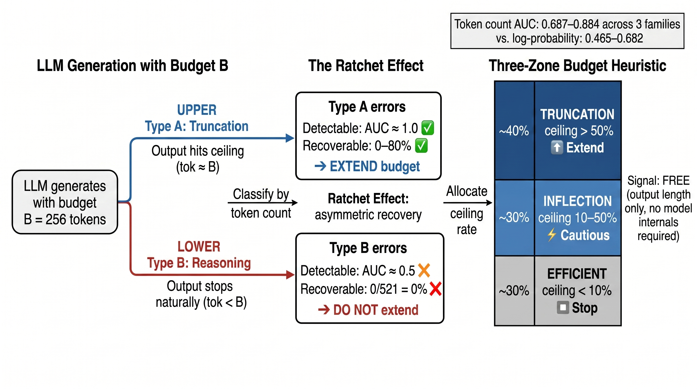

# The Truncation Signature: Free Signals and Deterministic Heuristics for Efficient Test-Time Compute Scaling

**Paper**: [`paper/The_Truncation_Signature.pdf`](paper/The_Truncation_Signature.pdf)

---

## Overview

Output token count is a **free correctness signal** for test-time compute allocation — requiring no model internals, no verifiers, no training. On 7B models, checking whether the output was truncated detects wrong answers with **AUC 0.865**, compared to **0.561 for log-probability**.

The signal works because LLM failures split into two types with radically different properties:

| | Type A (Truncation) | Type B (Reasoning) |
|---|---|---|
| **Cause** | Output cut off by budget | Output complete but wrong |
| **Detectable** | Yes (token count ≈ budget) | No (looks like correct output) |
| **Recoverable** | Yes, 0–80% with more tokens | **No — never** (0/469) |

This asymmetry — the **Ratchet Effect** — yields a zero-overhead budget allocation heuristic.

## Key Results

### 1. Token Count as Free Correctness Signal (AUC 0.865)

| Model | Dataset | Token AUC | Logprob AUC | Advantage |
|---|---|---|---|---|
| Qwen2.5-7B | MATH | **0.865** | 0.561 | 1.54× |
| Qwen2.5-7B | GSM8K | **0.880** | 0.465 | 1.89× |
| Gemma-2-9B | MATH | **0.731** | 0.584 | 1.25× |
| Gemma-2-9B | GSM8K | **0.699** | 0.538 | 1.30× |
| LLaMA-3-8B | MATH | **0.687** | 0.682 | 1.01× |
| LLaMA-3-8B | GSM8K | **0.713** | 0.601 | 1.19× |
| Qwen2.5-7B | HumanEval | **0.884** | 0.650 | 1.36× |

### 2. The Ratchet Effect (0/469 Natural-Stop Recovery)

Under greedy decoding, a model that stops naturally at a wrong answer produces the **identical output** at any higher budget:

- **Natural-stop errors**: 0/469 recover across 3 model families and 3 tasks
- **Ceiling-hit errors**: 438/803 recover (54.5%) with more tokens
- **Fisher's exact test**: *p* < 10⁻⁹⁹

### 3. Three-Zone Budget Heuristic

Based on ceiling rate (fraction of outputs hitting the budget), no verifiers or training needed:

| Zone | Ceiling Rate | Action |
|---|---|---|
| **TRUNCATION** | >50% | Extend budget — model is compute-starved |
| **INFLECTION** | 10–50% | Cautious extension — diminishing returns |
| **EFFICIENT** | <10% | Stop — model has converged |

Ceiling rate correlates with accuracy at Pearson *r* = −0.987 across all evaluated conditions.

### 4. Extension to Reasoning Models

DeepSeek-R1-Distill-7B requires 2.0× more tokens to escape truncation but reaches the **same accuracy ceiling** (80.5–81.0%) as standard Qwen2.5-7B. The framework applies beyond instruction-tuned models.

## Architecture

<p align="center">
  
</p>

<p align="center"><strong>The Truncation Signature Framework.</strong> (a) LLM outputs at budget B split by token count: ceiling-hit (tok ≈ B) vs. natural-stop (tok < B). (b) The Ratchet Effect: Type A (truncation) errors are detectable and recoverable (438/803); Type B (reasoning) errors are undetectable and irrecoverable (0/469). (c) Three-Zone budget heuristic based on ceiling rate, requiring no verifiers or training.</p>

## Repository Structure

```
├── paper/
│   └── The_Truncation_Signature.pdf   # Paper PDF
├── figures/
│   ├── fig_overview.jpeg              # Framework overview (Figure 1)
│   ├── fig_overview.pdf               # Framework overview (vector)
│   ├── fig_ratchet_effect.pdf         # Ratchet Effect (Figure 3)
│   ├── fig_token_signal_roc.pdf       # ROC curves (Figure 5)
│   └── fig_budget_spectrum_v3.pdf     # Budget spectrum (Figure 6)
├── scripts/
│   ├── run_logprob_collection.py      # Log-probability collection
│   ├── run_llama8b_math_logprob.py    # LLaMA-3-8B logprob
│   ├── run_gemma9b_logprob.py         # Gemma-2-9B logprob
│   ├── run_humaneval.py               # HumanEval evaluation
│   ├── run_overthinking_r1_efficient.py  # R1-Distill experiments
│   ├── run_efficiency_frontier_7b.py  # Efficiency frontier
│   ├── run_multiseed_validation.py    # Multi-seed validation
│   ├── run_sampling_ratchet.py        # Sampling ratchet (temp=0.7)
│   ├── adaptive_routing_v2.py         # Adaptive budget routing
│   └── ...                            # Additional analysis scripts
├── results_sample/
│   ├── math_real_200.json             # MATH benchmark (200 problems)
│   ├── gsm8k_real_200.json            # GSM8K benchmark (200 problems)
│   ├── humaneval_164.json             # HumanEval benchmark (164 problems)
│   └── example_result_format.json     # Example result format
└── README.md
```

## Models and Datasets

### Models Used

| Model | Source |
|---|---|
| Qwen2.5-0.5B-Instruct | [HuggingFace Qwen/Qwen2.5-0.5B-Instruct](https://huggingface.co/Qwen/Qwen2.5-0.5B-Instruct) |
| Qwen2.5-3B-Instruct | [HuggingFace Qwen/Qwen2.5-3B-Instruct](https://huggingface.co/Qwen/Qwen2.5-3B-Instruct) |
| Qwen2.5-7B-Instruct | [HuggingFace Qwen/Qwen2.5-7B-Instruct](https://huggingface.co/Qwen/Qwen2.5-7B-Instruct) |
| Gemma-2-2B-IT | [HuggingFace google/gemma-2-2b-it](https://huggingface.co/google/gemma-2-2b-it) |
| Gemma-2-9B-IT | [HuggingFace google/gemma-2-9b-it](https://huggingface.co/google/gemma-2-9b-it) |
| LLaMA-3-8B-Instruct | [HuggingFace meta-llama/Meta-Llama-3-8B-Instruct](https://huggingface.co/meta-llama/Meta-Llama-3-8B-Instruct) |
| DeepSeek-R1-Distill-Qwen-7B | [HuggingFace deepseek-ai/DeepSeek-R1-Distill-Qwen-7B](https://huggingface.co/deepseek-ai/DeepSeek-R1-Distill-Qwen-7B) |

### Datasets

| Dataset | Size | Source |
|---|---|---|
| MATH | 200 problems (subset) | [Hendrycks et al., 2021](https://github.com/hendrycks/math) |
| GSM8K | 200 problems (subset) | [Cobbe et al., 2021](https://huggingface.co/datasets/gsm8k) |
| HumanEval | 164 problems | [Chen et al., 2021](https://github.com/openai/human-eval) |

### Full Results Data

The complete experiment results (200+ JSON files across all models, budgets, and seeds) are available upon request. Contact the authors for access.

## Reproduction

### Environment

```bash
pip install torch transformers scikit-learn matplotlib numpy
```

### Quick Start

1. Download models to a local directory (e.g., `/mnt/data/pre_model/`)
2. Run evaluations:
```bash
# Baseline evaluation (token count + correctness)
python scripts/run_logprob_collection.py
```

## Citation

```bibtex
@article{truncation_signature_2026,
  title={The Truncation Signature: Free Signals and Deterministic Heuristics for Efficient Test-Time Compute Scaling},
  author={Anonymous},
  year={2026}
}
```

## License

This repository contains research artifacts for academic use.
